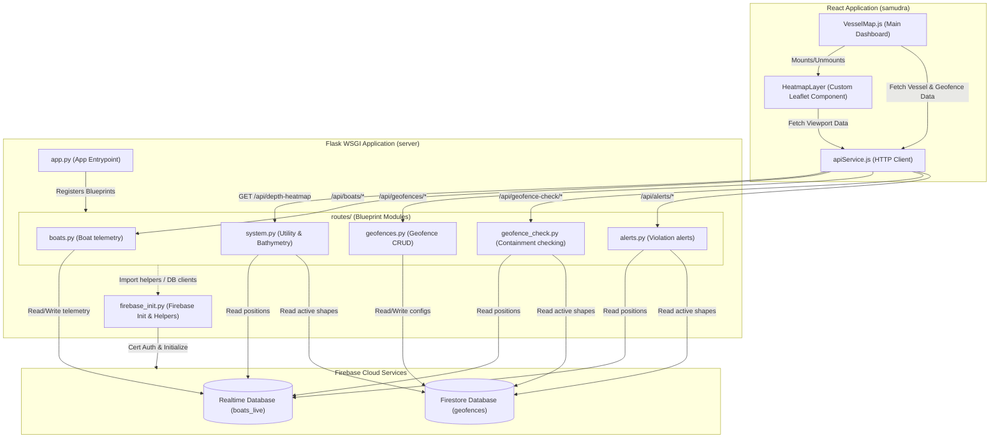

# Samudra Vessel Tracking & Seafloor Bathymetry Heatmap

Welcome to the **Samudra System**, a complete real-time vessel monitoring, geofencing, and seafloor bathymetry heatmap dashboard. The application is built with a modular Python (Flask) backend connected to Firebase (Firestore + Realtime DB) and a responsive React frontend mapping client.

---

## 🗺️ System Architecture

The following diagram illustrates the data flow, database connections, and architecture of the refactored Samudra system:



---

## 📁 File Structure

```
c:/code-2026/idp/samudra-2/
├── README.md                 # This file
├── QUICK_START.md            # Getting started guide
├── test_boat_api.py          # Automated CLI testing script
├── samudra/                  # React Frontend Application
│   ├── package.json          # Node dependencies & scripts
│   ├── src/
│   │   ├── App.js            # React App root component
│   │   ├── VesselMap.js      # Main map dashboard with HeatmapLayer
│   │   ├── services/
│   │   │   └── apiService.js # API client service for all endpoints
│   │   ├── config/
│   │   │   └── config.js     # Frontend configuration (ports, default map coords)
│   │   └── utils/
│   │       ├── helpers.js    # Data formatting and styling utilities
│   │       ├── alertSystem.js# Dynamic UI alert alerts wrapper
│   │       └── boatSimulation.js # Mock boat location path simulation
└── server/                   # Python Flask Backend
    ├── app.py                # Main server entrypoint (registrations)
    ├── config.py             # Server environmental config
    ├── firebase_init.py      # Database initializer and helper utilities
    ├── geofence_utils.py     # Old polygon helper functions
    ├── requirements.txt      # Python dependencies list
    └── routes/               # Blueprint-specific API route files
        ├── __init__.py       # Package marker
        ├── boats.py          # Boat CRUD routes
        ├── geofences.py      # Geofence CRUD routes
        ├── geofence_check.py # Geospatial containment routes
        ├── alerts.py         # Violation alerts routes
        ├── system.py         # Health, Stats, & Bathymetry routes
```

---

## ⚙️ Detailed File descriptions

### Backend (Python)

* **`app.py`**: Minimal entrypoint file. Imports environment variables, creates the Flask WSGI instance, configures CORS, triggers the Firebase connection setup (`firebase_init.py`), registers all route blueprints, and runs the server.
* **`firebase_init.py`**: Initializes the Firebase Admin SDK using certificate JSON or environmental service account configuration. Exposes Firestore client `db_firestore`, along with database mapping helper utilities:
  - `get_rtdb_ref(path)`: Retrieves database references for Realtime DB.
  - `rtdb_boat_to_api(boat_id, boat_data)`: Converts a Realtime DB schema node to the shape expected by the frontend.
  - `coords_to_db()`, `coords_from_db()`, `coords_to_shapely()`: Map coordinates format between frontend arrays, Firestore objects, and Shapely points/polygons.
* **`routes/boats.py`**: Exposes CRUD endpoints for vessel management. It connects to the Firebase Realtime Database node `boats_live` for lightweight, real-time telemetry updates.
* **`routes/geofences.py`**: Implements endpoints for managing geofence polygons (restricted regions or safe zones) in Firestore. Coordinates are mapped to Firestore-friendly formats automatically.
* **`routes/geofence_check.py`**: Contains geometry logic powered by `Shapely`. It pulls coordinates from Firestore, constructs spatial polygons, checks if vessel positions (lat/lng Point) overlap them, and returns containing boundaries.
* **`routes/alerts.py`**: Periodically polled by the frontend to fetch boats currently violating restricted boundaries.
* **`routes/system.py`**: Holds general statistics, API health check responses, and the **Sea Floor Depth Heatmap Generator**. The heatmap generator takes screen bounding parameters, builds a high-density viewport grid, filters out land using coastline estimation, calculates depth using a smooth continental shelf model, scales local terrain, and normalizes output weights.

### Frontend (React)

* **`VesselMap.js`**: Core dashboard file containing the Leaflet interactive map rendering, fleet listings sidebar, geofence editing canvas controls, and the custom `<HeatmapLayer />` mounting toggle.
* **`VesselMap.js -> HeatmapLayer`**: Viewport-bounded custom Leaflet plugin component. Listens to Leaflet `moveend` (pan/zoom finished) and `zoomend` events to dynamically query the backend for seafloor values in the visible viewport, rendering them as a smooth canvas heatmap with dynamic radius settings.
* **`services/apiService.js`**: Reusable JS Axios/Fetch client mapping backend requests to clean ES6 Promise functions.

---

## 🔌 API Endpoints & Functions Map

| Route Path | HTTP Method | Route File | Handler Function | DB Target | Description |
|---|---|---|---|---|---|
| `/api/boats` | GET | `routes/boats.py` | `get_boats` | Realtime DB | Returns all active vessels and GPS coordinates. |
| `/api/boats/<boat_id>` | GET | `routes/boats.py` | `get_boat` | Realtime DB | Returns metadata & GPS details of a single vessel. |
| `/api/boats/<boat_id>` | DELETE | `routes/boats.py` | `delete_boat` | Realtime DB | Removes a vessel entry from the database. |
| `/api/boats/<boat_id>/location` | PUT | `routes/boats.py` | `update_boat_location` | Realtime DB | Updates the GPS longitude, latitude, speed, and time. |
| `/api/geofences` | GET | `routes/geofences.py` | `get_geofences` | Firestore | Fetches all active geofence polygons. |
| `/api/geofences/<geofence_id>` | GET | `routes/geofences.py` | `get_geofence` | Firestore | Retrieves details of a single geofence. |
| `/api/geofences` | POST | `routes/geofences.py` | `create_geofence` | Firestore | Creates a new active geofence boundary. |
| `/api/geofences/batch/create` | POST | `routes/geofences.py` | `create_multiple_geofences` | Firestore | Performs batch creation of geofence polygons. |
| `/api/geofences/<geofence_id>` | PUT | `routes/geofences.py` | `update_geofence` | Firestore | Modifies names, descriptions, or shapes of a geofence. |
| `/api/geofences/<geofence_id>` | DELETE | `routes/geofences.py` | `delete_geofence` | Firestore | Removes a geofence definition from Firestore. |
| `/api/geofences/<geofence_id>/coordinates` | PUT | `routes/geofences.py` | `update_geofence_coordinates` | Firestore | Updates only the boundary points array of a geofence. |
| `/api/geofence-check/boat/<boat_id>` | GET | `routes/geofence_check.py` | `check_boat_in_geofence` | RTDB + FS | Evaluates if a specific boat overlaps restricted geofences. |
| `/api/geofence-check/all-boats` | GET | `routes/geofence_check.py` | `check_all_boats_geofence` | RTDB + FS | Performs an all-boats live containment inspection. |
| `/api/geofence-check/location` | POST | `routes/geofence_check.py` | `check_location_in_geofence` | Firestore | Inspects an arbitrary coordinate `[lat, lng]` for violations. |
| `/api/alerts` | GET | `routes/alerts.py` | `get_alerts` | RTDB + FS | Gets list of active geofence violations. |
| `/api/alerts/<boat_id>` | GET | `routes/alerts.py` | `get_boat_alerts` | RTDB + FS | Retrieves active violations list for a single boat. |
| `/api/health` | GET | `routes/system.py` | `health` | RTDB + FS | Performs simple write/read check on db connections. |
| `/api/stats` | GET | `routes/system.py` | `get_stats` | RTDB + FS | Returns summary numbers (vessels, active GPS fixes). |
| `/api/depth-heatmap` | GET | `routes/system.py` | `get_depth_heatmap` | None | Returns viewport-bounded, normalized bathymetric grid. |

---

## 🚀 Getting Started

### 1. Prerequisites
- **Python 3.8+** with `pip`
- **Node.js 16+** with `npm`

### 2. Startup Commands

#### Terminal 1: Python Backend
```bash
cd server
# Initialize virtual environment
python -m venv venv
.\venv\Scripts\activate

# Install dependencies
pip install -r requirements.txt

# Launch server on port 5000
python app.py
```

#### Terminal 2: React Frontend
```bash
cd samudra
# Install dependencies
npm install

# Launch web server on port 3000
npm start
```

#### Terminal 3: Automated API Tests
```bash
# Verify all endpoint connections and spatial checks
python test_boat_api.py
```
